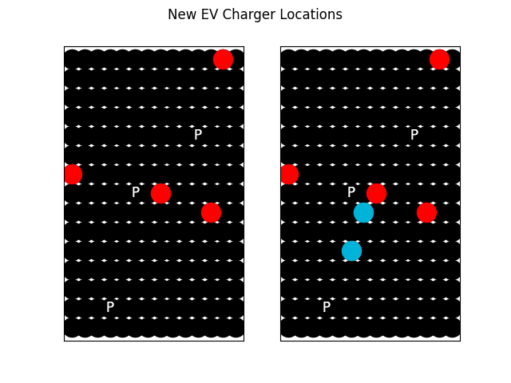
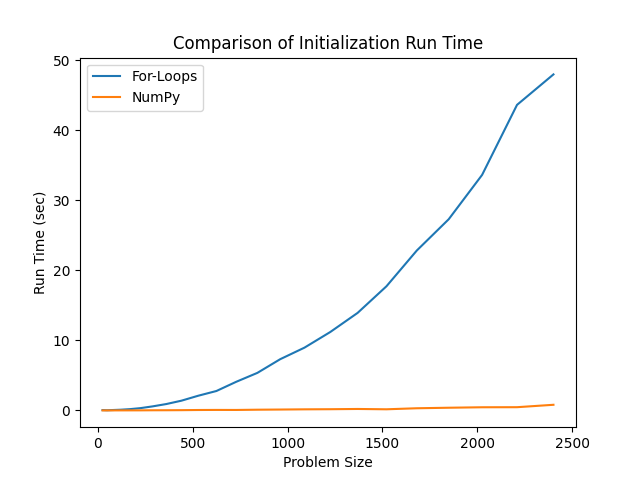

[](
  https://codespaces.new/dwave-examples/ev-charger-placement?quickstart=1)
[](
  https://circleci.com/gh/dwave-examples/ev-charger-placement)

# Placement of Charging Stations

Determining optimal locations to build new electric vehicle charging stations
is a complex optimization problem.  Many factors should be taken into
consideration, like existing charger locations, points of interest (POIs),
quantity to build, etc. In this example, we take a look at how we might
formulate this optimization problem and solve it using D-Wave's binary
quadratic model (BQM) hybrid solver.

## Installation

You can run this example without installation in cloud-based IDEs that support
the [Development Containers specification](https://containers.dev/supporting)
(aka "devcontainers").

For development environments that do not support ``devcontainers``, install
requirements:

    pip install -r requirements.txt

If you are cloning the repo to your local system, working in a
[virtual environment](https://docs.python.org/3/library/venv.html) is
recommended.

## Usage

Your development environment should be configured to
[access Leap’s Solvers](https://docs.dwavequantum.com/en/latest/ocean/sapi_access_basic.html).
You can see information about supported IDEs and authorizing access to your Leap
account [here](https://docs.dwavequantum.com/en/latest/leap_sapi/dev_env.html).

To run the demo, type the command:

```python demo.py```

The program will construct a 14x15 grid representation of a city, and randomly
place 3 POIs and 4 current charging station locations. Using the BQM hybrid
solver, locations for 2 new charging stations will be selected.

After the new charging station locations have been selected, an image is
created. This image shows the current map with existing charging locations
shown in red and POIs denoted by P (left figure), as well as a future map with
the future charging station locations colored in blue (right figure). This
image is saved as ```map.png```, as shown in the image below.



Finally, the new charging locations within the grid are printed on the command
line for the user, as well as some information on distances in the new map.

### Customizing the scenario

Options are also provided for the user to customize several components of the
randomly generated scenario.

- `-x`: set the grid horizontal dimension. Default: 15.
- `-y`: set the grid vertical dimension. Default: 15.
- `-p`: set the number of POIs on the grid. Default: 3.
- `-c`: set the number of existing charging stations on the grid. Default: 4.
- `-n`: set the number of new charging stations to be placed. Default: 2.
- `-s`: set a random seed so that specific senarios can be repeated.

Any combination of these options may be used. For example:

```python demo.py -x 10 -y 10 -c 2```

builds a random scenario on a 10x10 grid with 3 POIs, 2 existing chargers, and
2 new locations to be identified.

## Problem Formulation

There are many different variations of the electric vehicle charger placement
problem that might be considered. For this demo, we examine the case in which a
small region is under consideration, and all locations in our area of
consideration are within walking distance. In this situation, we want to place
new charging locations that are convenient to all POIs. For example, if the
POIs are shops on a main street it is most convenient to park once in a central
location. We will satisfy this need by considering the average distance from a
potential new charging location all POIs [[1]](#1). Additionally, we want to
place new chargers away from existing and other new charging locations so as to
minimize overlap and maximize coverage of the region.

This problem can be considered as a set of 4 independent constraints (or
objectives) with binary variables that represent each potential new charging
station location.

### Minimize distance to POIs

For each potential new charging station location, we compute the average
distance to all POIs on the map. Using this value as a linear bias on each
binary variable, our program will prefer locations that are (on average) close
to the POIs. Note that this constraint could be replaced by an alternative one
depending on the real world scenario for this problem.

### Maximize distance to existing charging stations

For each potential new charging station location, we compute the average
distance to all existing charging locations on the map. Using the negative of
this value as a linear bias on each binary variable, our program will prefer
locations that are (on average) far from existing chargers.

### Maximize distance to other new charging stations

For the pair of new charging station locations, we would like to maximize the
distance between them. To do this, we consider all possible pairs of locations
and compute the distance between them.  Using the negative of this value as a
quadratic bias on the product of the corresponding binary variables, our
program will prefer locations that are far apart.

### Build exactly two new charging stations

To select exactly two new charging stations, we use
[`dimod.generators.combinations`](https://docs.dwavequantum.com/en/latest/ocean/api_ref_dimod/generated/dimod.generators.combinations.html). This function in Ocean's `dimod` package
sets exactly `num_new_cs` of our binary variables (`bqm.variables`) to have a
value of 1, and applies a strength to this constraint (`gamma4`). See below for
more information on the tunable strength parameter.

### Parameter tuning

Each of these constraints is built into our BQM object with a coefficient
(names all start with `gamma`).  This term gamma is known as a Lagrange
parameter and can be used to weight the constraints against each other to
accurately reflect the requirements of the problem. You may wish to adjust this
parameter depending on your problem requirements and size. The value set here
in this program was chosen to empirically work well as a starting point for
problems of a wide-variety of sizes. For more information on setting this
parameter, see D-Wave's [Problem Formulation
Guide](https://www.dwavesys.com/practical-quantum-computing-developers).

## Faster BQM Construction

An alternative demo file, `demo_numpy.py`, shows how the BQM for this problem
can be constructed using NumPy arrays and vectors. Utilizing NumPy and matrix
operations allows for a much faster construction of the BQM than building it
with for-loops. As problem instances become larger and larger, it becomes more
and more important to efficiently build the BQM to save time in the
initialization and setup of the model. The chart below demonstrates the savings
in classical compute time when setting up the BQM for this problem using
for-loops versus using efficient NumPy operations in the Leap IDE.



## References

<a name="1">[1]</a> Pagany, Raphaela, Anna Marquardt, and Roland Zink. "Electric Charging Demand Location Model—A User-and Destination-Based Locating Approach for Electric Vehicle Charging Stations." Sustainability 11.8 (2019): 2301. [https://doi.org/10.3390/su11082301](https://doi.org/10.3390/su11082301)
